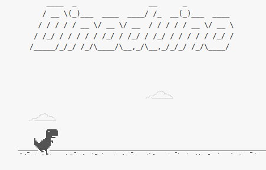
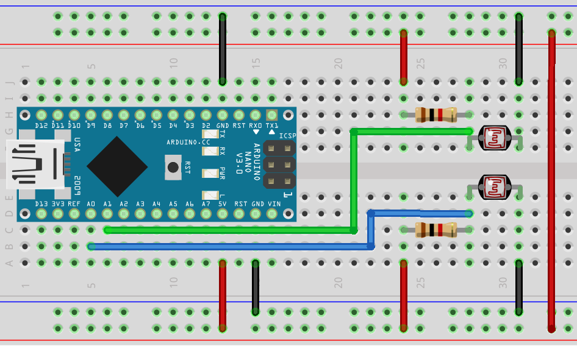

# Dinoduino




## Simple solution
If you have Leonardo, Esplora, Zero or Due boards, the solution looks like this (you don't need a python script):

```C++
#include <Keyboard.h>

#define JUMP_SENSOR_PIN A0
#define DUCK_SENSOR_PIN A1

void setup() {
    Keyboard.begin();
}

void loop() {
    int jump_data = analogRead(JUMP_SENSOR_PIN);
    int duck_data = analogRead(DUCK_SENSOR_PIN);

    if (jump_data >= 250) {
        Keyboard.write(0x20);
    }

    if (duck_data >= 250) {
        Keyboard.write(0x20);
    }
}
```

## Running
Assemble the device as shown in the diagram



Attach the photoresistors to the points shown in the image


Upload the sketch to the Board and connect it to your computer using Arduino IDE

Install the necessary libraries and run the script
```
pip install -r requirements.txt
python3 main.py
```
